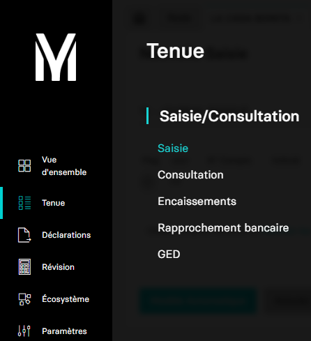

# Récupérer le flux manuel

Ce guide a pour but de vous aider dans la récupération du flux manuel.

Dans l'application MyUnisoft vous pouvez importer vos relevés bancaires depuis le menu:
`Tenue` > `Saisie` > `Flux manuel`




## API

La route https://api.myunisoft.fr/api/v1/document/pending permet de récupérer ces documents.

> 👀 Penser à préciser l'en-tête **society-id** si vous utilisez un 🔹 Accès cabinet.

Les parmètres de l'URL sont:

| clé | exemple | description |
| --- | --- | --- |
| limit | 25 | REQUIRED |
| offset | 5 | OPTIONAL |
| sort_date_direction | desc | OPTIONAL - asc ou desc (ascendant ou descendant) |
| filter |  | ??? |

```bash
curl --location --request GET 'https://api.myunisoft.fr/api/v1/document/pending?limit=25&offset=5&sort_date_direction=desc&filter' \
--header 'X-Third-Party-Secret: {{X-Third-Party-Secret}}' \
--header 'society-id;' \
--header 'Authorization: Bearer {{API-TOKEN}}'
```

Si tout se passe bien vous devriez recevoir un JSON avec **une structure similaire à l'exemple ci-dessous**

```json
{
  "list_manual_document": [
    {
      "created_date": "2021-10-21T14:05:09.000",
      "document_attached_id": 0,
      "documents": [
        {
          "date": "2021-10-21T14:05:09.000",
          "document_id": 3843271,
          "invoice_type_id": 1,
          "link": "https://mycloud.myunisoft.fr/index.php/s/Db7TrDHziQsiSG3",
          "name": "factureFCW142.pdf",
          "thumbnail": "https://mycloud.myunisoft.fr/index.php/apps/files_sharing/publicpreview/Db7TrDHziQsiSG3?x=90&y=120&a=true",
          "token": "Db7TrDHziQsiSG3"
        }
      ],
      "row_number": 1
    }
  ],
  "pages_number": 2,
  "rows_number": 1
}
```

```ts
interface ResponseBody {
  list_manual_document: ManualDocumentListEntity[];
  pages_number: number;
  rows_number: number;
}

interface ManualDocumentListEntity {
  created_date: string;
  document_attached_id: number;
  documents: DocumentListEntity[];
  row_number: number;
}

interface DocumentListEntity {
  date: string;
  document_id: number;
  invoice_type_id: number;
  link: string;
  name: string;
  thumbnail: string;
  token: string;
}
```
