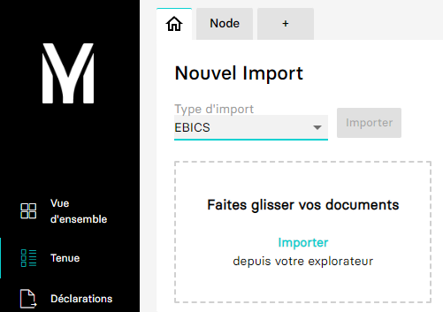

# Importer un relevé bancaire/fichier EBICS

Ce guide a pour but de vous aider dans l'envoi de vos relevés bancaires/fichiers EBICS.

Dans l'application MyUnisoft vous pouvez importer vos relevés bancaires depuis le menu:
`Tenue` > `Flux` > `Imports`


Sélectionnez le type EBICS



## API

La route https://api.myunisoft.fr/api/v1/releve_bancaire permet d'importer ces fichiers.

> 👀 Pensez à préciser l'en-tête **society-id** si vous utilisez un 🔹 Accès cabinet ??? Non d'après l'appli.

Les parmètres de l'URL sont:

| clé | exemple | description |
| --- | --- | --- |
| filename | mon_fichier.dat | REQUIRED - Format: ".dat" - Contains account entries. |

```bash
curl --location --request POST 'https://api.myunisoft.fr/api/v1/releve_bancaire?filename=mon_fichier.dat' \
--header 'X-Third-Party-Secret: {{X-Third-Party-Secret}}' \
--header 'Content-Type: application/octet-stream' \
--header 'society-id: 3' \
--data-raw ''
```
